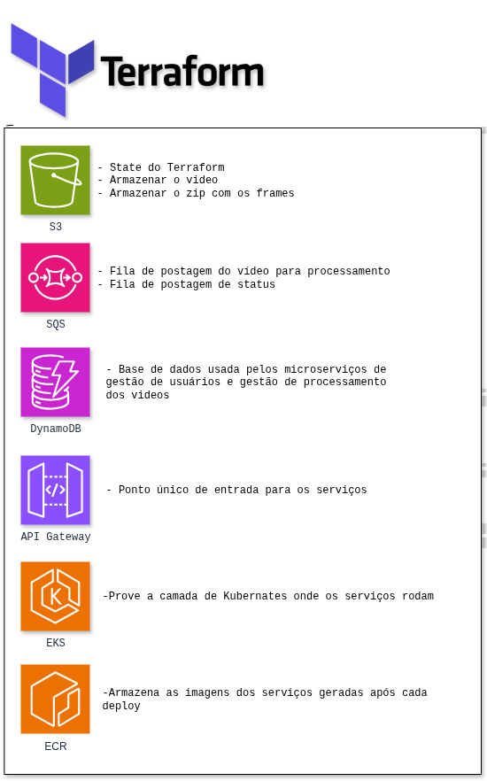
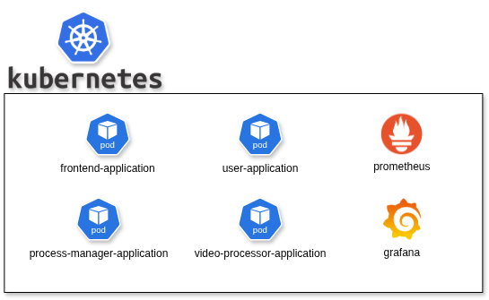
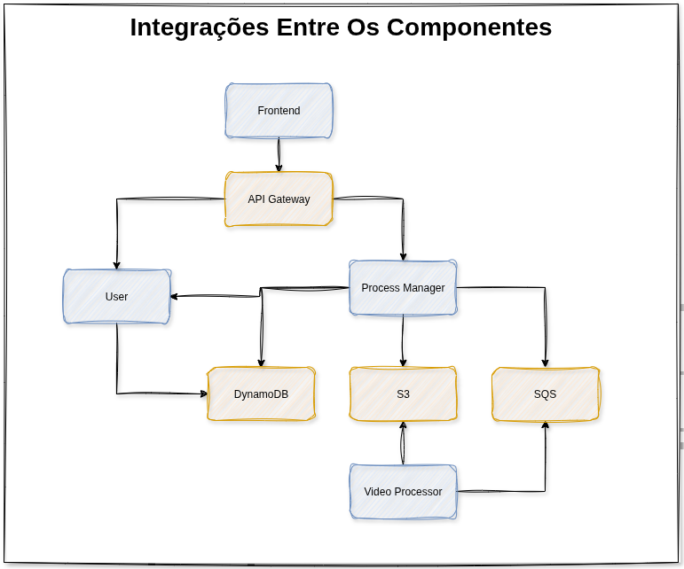
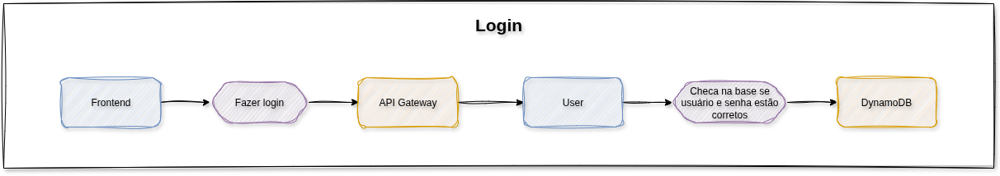
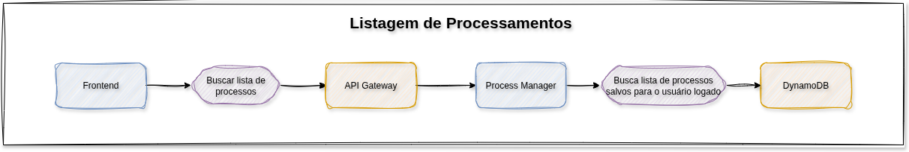
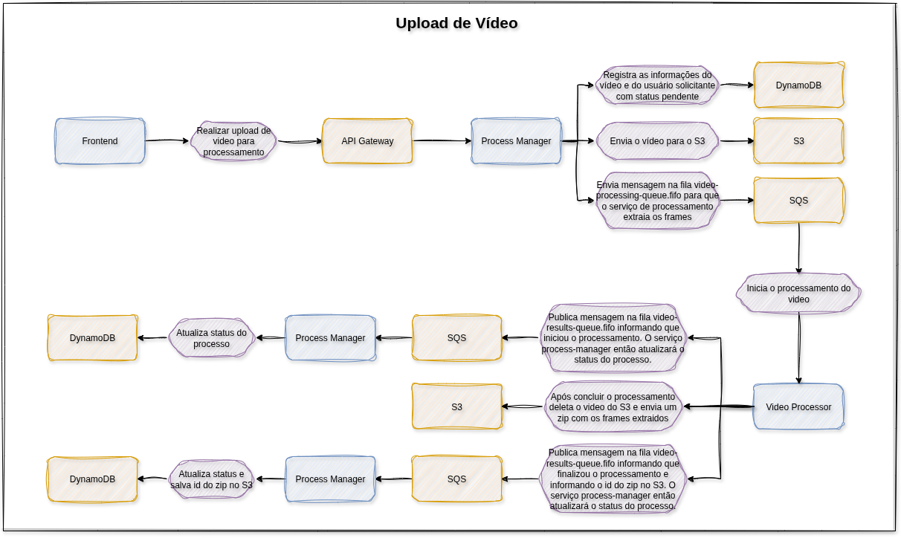
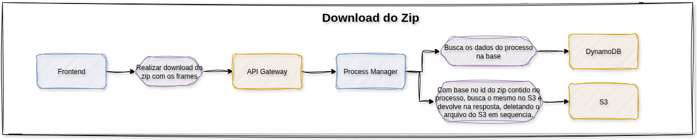
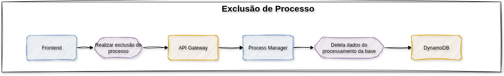
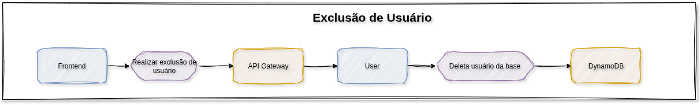

# 🎬 Sistema de Processamento de Vídeos - FIAP X

## 👀 Visão Geral

Este projeto implementa uma arquitetura de microsserviços para processamento de vídeos, permitindo que usuários façam upload de vídeos, acompanhem o status do processamento e façam download dos frames extraídos em formato zip. O sistema é escalável, resiliente e utiliza boas práticas de arquitetura, mensageria, monitoramento e CI/CD.

✨ **Principais destaques:**
- Microsserviços desacoplados
- Processamento assíncrono
- Monitoramento em tempo real
- Deploy automatizado

---

## 🧩 Microsserviços

### 👤 1. User Application
- Gerencia usuários: cadastro, autenticação, listagem, remoção.
- Persistência: **DynamoDB**

### ⚙️ 2. Process Manager Application
- Recebe requisições de processamento de vídeo
Sobe vídeos no S3
- Publica mensagens no SQS para processamento
- Persiste status dos vídeos no **DynamoDB**
- Permite acompanhar status dos vídeos e baixar arquivos zipados
- Gerencia exclusão de arquivos processados

### 🎥 3. Video Processor Application (Go)
- Consome mensagens do SQS
- Baixa vídeos do S3, processa e gera frames
- Sobe arquivos zipados de frames no S3
- Publica mensagens de status no SQS (início, erro, sucesso)
- Deleta arquivos processados do S3

---

## 🏗️ Componentes de Infraestrutura

* **Frontend (Angular):** Interface web para interação do usuário
* **API Gateway (AWS API Gateway):** Ponto único de entrada para as APIs dos microsserviços, realizando apenas roteamento das requisições
        * Autenticação e autorização não são feitas diretamente pelo API Gateway. Quando uma requisição chega ao Manager MS, um middleware consulta o User Application MS para validar o token do usuário antes de processar a solicitação
* **Mensageria (AWS SQS):** Orquestração do processamento de vídeos e comunicação entre Manager e Processor
* **Armazenamento (AWS S3):** Armazena vídeos originais e arquivos zipados de frames
* **DynamoDB:** Utilizado tanto pelo User Application MS quanto pelo Manager MS
* **Monitoramento (Prometheus + Grafana):** Coleta e exibe métricas dos microsserviços e infraestrutura, deploy em pods no EKS
* **Orquestração (EKS - Kubernetes AWS):** Deploy dos microsserviços, Prometheus, Grafana, escalabilidade automática
* **ECR (Elastic Container Registry):** Repositório de imagens Docker dos microsserviços. O repositório é criado automaticamente no momento do deploy dos serviços, caso ainda não exista, por meio dos workflows dos apps.
* **CI/CD (GitHub Actions):** Build, teste, análise de qualidade com SonarQube, push de imagens para o ECR, rollout automatizado no EKS

---

## 🔄 Fluxo de Processamento

**1** - Usuário faz upload do vídeo via frontend

**2** - API Gateway encaminha para Manager MS

**3** - Manager MS salva vídeo no S3, registra status no DynamoDB e publica mensagem no SQS

**4** - Video Processor MS consome mensagem do SQS, baixa vídeo do S3, processa, sobe zip dos frames no S3, publica status no SQS

**5** - Manager MS atualiza status no DynamoDB conforme mensagens do SQS

**6** - Usuário acompanha status e faz download do zip via frontend/API Gateway/Manager MS

**7** - Manager MS deleta zip do S3 após download

**8** - Monitoramento via Prometheus/Grafana

**9** - CI/CD automatizado via GitHub Actions

---

## ✅ Requisitos Funcionais

* Processar mais de um vídeo ao mesmo tempo
* Não perder requisições em caso de picos
* Sistema protegido por usuário e senha
* Listagem de status dos vídeos de um usuário
* Notificação ao usuário em caso de erro (e-mail ou outro meio)

## 🛠️ Requisitos Técnicos

* Persistência dos dados
* Arquitetura escalável
* Projeto versionado no Github
* Testes automatizados
* CI/CD

## 🧑‍💻 Stack Tecnológica

* **Containers:** Docker + Kubernetes (EKS)
* **Mensageria:** AWS SQS
* **Banco de Dados:** DynamoDB (User e Manager)
* **Armazenamento:** AWS S3
* **Monitoramento:** Prometheus + Grafana
* **CI/CD:** GitHub Actions
* **Frontend:** Angular
* **API Gateway:** AWS API Gateway

---

## 🗺️ Arquitetura

Todos os recursos de cloud são provisionados de forma automatizada via Terraform, garantindo rastreabilidade e reprodutibilidade das infraestruturas. 🛠️

As aplicações e serviços de monitoramento (Prometheus + Grafana) rodam em containers no EKS (Kubernetes AWS), aproveitando escalabilidade automática e alta disponibilidade. ☸️

O diagrama abaixo mostra como os componentes do sistema (aplicações e recursos cloud) se integram e se comunicam:

Os principais fluxos do sistema estão detalhados nas imagens a seguir, ilustrando login, upload, processamento, download e gestão de usuários:

---

## 💡 Observações

* Todos os microsserviços expõem métricas para Prometheus
* API Gateway ponto único de entrada para as APIs dos microsserviços
* SQS garante resiliência e processamento assíncrono
* EKS permite escalabilidade e alta disponibilidade
* CI/CD garante qualidade e automação do deploy
* SonarQube é utilizado para análise contínua da qualidade do código, integrado ao pipeline do GitHub Actions

---

## 📦 Entregáveis

* Documentação da arquitetura proposta
* Script de criação dos recursos (infra, banco, etc)
* Código versionado no Github
* Apresentação em vídeo (até 10 minutos) mostrando documentação, arquitetura e funcionamento do projeto
