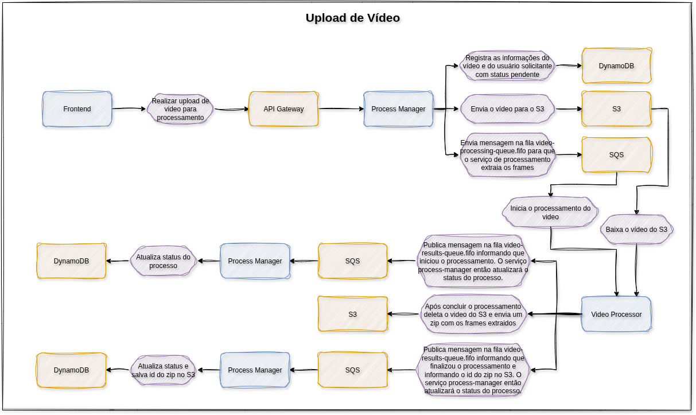

# 🎬 Sistema de Processamento de Vídeos - FIAP X

## 👀 Visão Geral

Este projeto implementa uma arquitetura de microsserviços para processamento de vídeos, permitindo que usuários façam upload de vídeos, acompanhem o status do processamento e façam download dos frames extraídos em formato zip. O sistema é escalável, resiliente e utiliza boas práticas de arquitetura, mensageria, monitoramento e CI/CD.

✨ **Principais destaques:**
- Microsserviços desacoplados
- Processamento assíncrono
- Monitoramento em tempo real
- Deploy automatizado

---

## 🧩 Microsserviços

### 👤 1. User Application MS
- Gerencia usuários: cadastro, autenticação, listagem, remoção
- Persistência: **DynamoDB**

### ⚙️ 2. Process Manager Application MS
- Recebe requisições de processamento de vídeo
- Sobe vídeos no S3
- Publica mensagens no SQS para processamento
- Persiste status dos vídeos no **DynamoDB**
- Permite acompanhar status dos vídeos e baixar arquivos zipados
- Gerencia exclusão de arquivos processados

### 🎥 3. Video Processor Application MS (Go)
- Consome mensagens do SQS
- Baixa vídeos do S3, processa e gera frames
- Sobe arquivos zipados de frames no S3
- Publica mensagens de status no SQS (início, erro, sucesso)
- Deleta arquivos processados do S3

---

## 🏗️ Componentes de Infraestrutura

* 🖥️ **Frontend (Angular):** Interface web para interação do usuário
* 🚪 **API Gateway (AWS API Gateway):** Ponto único de entrada para as APIs dos microsserviços, realizando apenas roteamento das requisições
        * 🔒 A autenticação e autorização não são feitas diretamente pelo API Gateway. Quando uma requisição chega ao Manager MS, um middleware consulta o User Application MS para validar o token do usuário antes de processar a solicitação
* 📬 **Mensageria (AWS SQS):** Orquestração do processamento de vídeos e comunicação entre Manager e Processor
* 🗄️ **Armazenamento (AWS S3):** Armazena vídeos originais e arquivos zipados de frames
* 🗃️ **DynamoDB:** Utilizado tanto pelo User Application MS quanto pelo Manager MS
* 📊 **Monitoramento (Prometheus + Grafana):** Coleta e exibe métricas dos microsserviços e infraestrutura, deploy em pods no EKS
* ☸️ **Orquestração (EKS - Kubernetes AWS):** Deploy dos microsserviços, Prometheus, Grafana, escalabilidade automática
* 🤖 **CI/CD (GitHub Actions):** Build, teste, análise de qualidade com SonarQube, push de imagens para ECR, rollout automatizado no EKS

---

## 🔄 Fluxo de Processamento

1️⃣ Usuário faz upload do vídeo via frontend

2️⃣ API Gateway encaminha para Manager MS

3️⃣ Manager MS salva vídeo no S3, registra status no DynamoDB e publica mensagem no SQS

4️⃣ Video Processor MS consome mensagem do SQS, baixa vídeo do S3, processa, sobe zip dos frames no S3, publica status no SQS

5️⃣ Manager MS atualiza status no DynamoDB conforme mensagens do SQS

6️⃣ Usuário acompanha status e faz download do zip via frontend/API Gateway/Manager MS

7️⃣ Manager MS deleta zip do S3 após download

8️⃣ Monitoramento via Prometheus/Grafana

9️⃣ CI/CD automatizado via GitHub Actions

---

## ✅ Requisitos Funcionais

* 🚀 Processar mais de um vídeo ao mesmo tempo
* 📈 Não perder requisições em caso de picos
* 🔐 Sistema protegido por usuário e senha
* 📋 Listagem de status dos vídeos de um usuário
* 📢 Notificação ao usuário em caso de erro (e-mail ou outro meio)

## 🛠️ Requisitos Técnicos

* 💾 Persistência dos dados
* 📦 Arquitetura escalável
* 🗂️ Projeto versionado no Github
* 🧪 Testes automatizados
* 🤖 CI/CD

## 🧑‍💻 Stack Tecnológica

* 📦 **Containers:** Docker + Kubernetes (EKS)
* 📬 **Mensageria:** AWS SQS
* 🗃️ **Banco de Dados:** DynamoDB (User e Manager)
* 🗄️ **Armazenamento:** AWS S3
* 📊 **Monitoramento:** Prometheus + Grafana
* 🤖 **CI/CD:** GitHub Actions
* 🖥️ **Frontend:** Angular
* 🚪 **API Gateway:** AWS API Gateway

---

## 🗺️ Diagrama de Arquitetura (texto)

---

## 💡 Observações

* 📊 Todos os microsserviços expõem métricas para Prometheus
* 🚪 API Gateway ponto único de entrada para as APIs dos microsserviços
* 📬 SQS garante resiliência e processamento assíncrono
* ☸️ EKS permite escalabilidade e alta disponibilidade
* 🤖 CI/CD garante qualidade e automação do deploy
* 🧑‍🔬 SonarQube é utilizado para análise contínua da qualidade do código, integrado ao pipeline do GitHub Actions

---

## 📦 Entregáveis

* 📄 Documentação da arquitetura proposta
* 📝 Script de criação dos recursos (infra, banco, etc)
* 🗂️ Código versionado no Github
* 🎥 Apresentação em vídeo (até 10 minutos) mostrando documentação, arquitetura e funcionamento do projeto
